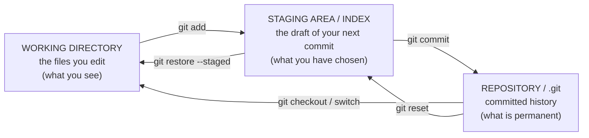
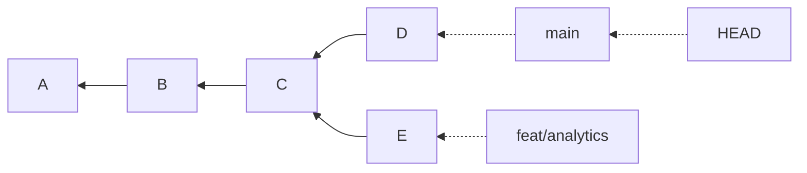

# CH-02 — The Git Mental Model

|  |  |
| - | - |

> **This chapter is the one you cannot skip.** Everything students find "confusing" about Git —
> `reset` vs `revert`, detached HEAD, why merges conflict, what a branch really is, why rebase
> changes hashes — is trivial once this model is in place and impossible to reason about without
> it. Time spent here is repaid four times over in CH-05, CH-12 and CH-13.

---

## Before you start

Nothing to install. Bring paper. You will draw graphs.

If you already have Git installed you can verify each claim as you go; otherwise install it in
CH-03 and return here for 10 minutes. Reading this chapter
without ever drawing the graph yourself is the most common way to *think* you learned it.

---

## A. Ask yourself

1. When you "save" in Git, what do you think gets stored: the whole file, or just the lines you
   changed?
2. You have 200 files and change 1. What does Git store?
3. What do you think a branch physically *is* — a copy of your project folder? A list of commits?
   Something else?
4. Why does Git force you to `add` a file before you can `commit` it? Why not commit everything
   that changed?
5. Two people change the same file at the same time. What information does Git need to combine
   them?

<details>
<summary><strong>Answers</strong></summary>

1. **The whole file** (conceptually a full snapshot of the project). Most students guess "just
   the changes" because that is what diffs look like in the UI. Correcting this early makes
   `reset`, `checkout` and `cherry-pick` far easier later. Git *displays* diffs; it *stores*
   snapshots.
2. Git stores a new snapshot of the project tree, but the 199 unchanged files are **not**
   duplicated — the new snapshot reuses pointers to the identical existing content, because
   content is stored by its hash. So: full snapshot semantics, deduplicated storage.
3. A branch is a **41-byte file containing one commit ID**. Nothing more. This single fact
   explains why branching is instant, why deleting a branch does not delete commits, and why
   `reset --hard` is "just moving a pointer."
4. Because *what you have changed* and *what belongs in the next version* are different sets.
   Staging is the deliberate act of composing a commit rather than dumping a workspace.
5. A common ancestor. Git finds the last commit both sides share and compares each side against
   it. Without that ancestor Git could only guess — this is exactly why the commit graph's shape
   matters (CH-05, CH-10).

</details>

---

## B. Analogy, then the real thing

**Analogy.** A commit is a **save point in a game**. It captures the entire world state, not just
the room you walked through. You can return to any save point. Save points know which save came
before them, so they form a chain.

**Where the analogy breaks:** game saves are a linear list and get overwritten. Git's save points
form a *graph* that can branch and rejoin, are never overwritten, and each is identified by a hash
of its content.

Keep the intuition (whole-world snapshot, linked to its predecessor). Drop the linearity.

---

## C. Model 1 — Git stores snapshots, not differences

Most version control systems store a base file plus a list of changes. **Git does not.** Every
commit records a complete picture of what every tracked file looked like at that moment.

```text
Commit 1        Commit 2        Commit 3
A1              A1  (reused)    A2  (changed)
B1              B2  (changed)   B2  (reused)
C1              C1  (reused)    C1  (reused)
```

Storage is not wasteful, because Git addresses content by its **SHA-1/SHA-256 hash**. Identical
content has an identical hash and is stored exactly once. `A1` in commit 2 is the *same object*
as `A1` in commit 1 — one copy, two references.

Two consequences you will rely on constantly:

* **Checking out any commit is cheap and complete.** Git doesn't replay a chain of patches; it
  reads a snapshot. This is why `git switch` to a month-old commit is instant.
* **Diffs are computed, not stored.** `git diff` compares two snapshots on demand. That's why the
  same commit can be displayed as a diff against its parent, against another branch, or against
  your working directory.

---

## D. Model 2 — The three trees `MOST IMPORTANT`

At any moment, Git holds **three versions of your project**:



| Tree              | Also called               | Holds                                       | Lost if you are careless?                                                    |
| ----------------- | ------------------------- | ------------------------------------------- | ---------------------------------------------------------------------------- |
| Working directory | worktree, workspace       | Your actual files, including edits and junk | **Yes** — uncommitted work is the only genuinely fragile thing in Git |
| Staging area      | index, cache              | A precise description of the*next* commit | Rebuildable                                                                  |
| Repository        | `.git`, object database | Every commit ever made                      | Practically never (CH-12)                                                    |

### Why staging exists — the part students skip

You spent the morning on a hostel maintenance tracker. You have:

* a finished bug fix in `complaints.py`,
* a half-written new feature in `analytics.py`,
* a debug `print()` in `app.py` you must not commit,
* `notes.txt` — personal scratch.

"Commit everything that changed" would produce one incoherent commit mixing a fix, broken code
and debug output. Nobody can review it, revert it, or understand it in six months.

Staging lets you say: *this fix, and only this fix, becomes the next version.*

> **Staging is not bureaucracy. It is the difference between a history that is a record and a
> history that is a landfill.** The entire value of CH-04, CH-09 and CH-12 depends on commits
> being coherent units.

Each file is in one of four states:

```text
untracked  ──git add──▶  staged  ──git commit──▶  committed (unmodified)
                            ▲                            │
                            │                        edit file
                            └──────git add───────── modified
```

`git status` is a live report of exactly this. Read it as a state machine, not as noise.

---

## E. Model 3 — A commit is an immutable object with a parent

A commit stores:

| Field                           | Example                                      | Note                                       |
| ------------------------------- | -------------------------------------------- | ------------------------------------------ |
| **tree**                  | pointer to the snapshot of the whole project |                                            |
| **parent(s)**             | `a1b2c3d`                                  | zero for the first commit, two for a merge |
| **author** + timestamp    | `Asha <asha@…>`                           | who wrote it                               |
| **committer** + timestamp | usually the same                             | differs after rebase/cherry-pick           |
| **message**               | `fix: reject empty complaint text`         |                                            |
| **id**                    | `9f2c1ab…`                                | **hash of all of the above**         |

Because the ID is a hash of everything including the parent ID:

* **Commits are immutable.** Change *anything* — a character in the message, the author date, the
  parent — and you get a different hash, which means a **different commit**.
* "Editing" a commit (`--amend`, rebase, cherry-pick) never edits it. It creates a *new* commit
  and moves a pointer. The old one still exists until garbage collection (CH-12's safety net).
* Because a commit's ID depends on its parent's ID, **a commit fixes its entire ancestry**. You
  cannot alter history without changing every commit after the alteration. This is why
  history-rewriting (CH-13) has consequences for everyone who already has those commits.

The result is a **directed acyclic graph** (DAG): each commit points *backwards* to its parent(s).

```text
A ◀── B ◀── C ◀── D          arrows point to the PARENT
```

Git only ever walks backwards. "What came after commit B?" is not a question Git can answer
directly — it has to scan. This explains a surprising amount of Git's behaviour.

---

## F. Model 4 — Branches are pointers, HEAD is a pointer to a pointer `COMMONLY MISUNDERSTOOD`

A branch is **a file containing one commit ID**. Look:

```bash
cat .git/refs/heads/main
# 9f2c1ab5d4e3c2b1a0987654321fedcba9876543
```

That is the entire branch. Not a folder, not a copy, not a list of commits.

**HEAD** is another such file, containing *which branch you are on*:

```bash
cat .git/HEAD
# ref: refs/heads/main
```



Now everything follows:

| Fact                                              | Why                                                                                                   |
| ------------------------------------------------- | ----------------------------------------------------------------------------------------------------- |
| Creating a branch is instant, even on a 2 GB repo | It writes 41 bytes                                                                                    |
| Committing "moves" the branch                     | The new commit's parent is the old tip; the branch file is rewritten to the new ID                    |
| `git switch` changes your files                 | It rewrites HEAD, then makes the working directory match the new commit's snapshot                    |
| Deleting a branch does not delete commits         | You deleted a pointer. The commits remain, merely unreferenced (recoverable — CH-12)                 |
| "Detached HEAD"                                   | HEAD points**directly at a commit** instead of at a branch. Not broken — just unnamed. (CH-14) |
| `reset --hard` "loses" commits                  | It only moves the branch pointer backwards; the commits are still there, reachable via`reflog`      |

> **The single most useful sentence in this course:** *A branch is a moving pointer to a commit;
> HEAD says which pointer you are moving.* Say it out loud. When a Git situation confuses you,
> ask: which pointers exist, where does each point, and which one is about to move?

### The "what is committed" question

"Which commits are on branch `main`?" is answered by: start at `main`, walk backwards through
parents, collect everything reachable. That is all "on a branch" means. A commit can be on many
branches at once — nothing is copied.

---

## G. Model 5 — The four places your work can be

Combining the three trees with remotes (CH-06) gives the complete picture:

```text
your editor ──▶ working directory ──add──▶ staging ──commit──▶ local repo ──push──▶ remote repo
                                                                    ▲                   │
                                                                    └─── fetch ─────────┘
```

Trouble almost always comes from a wrong belief about *which* of these five places your work is
in. When lost, ask in order:

1. Is it saved in my editor?
2. Is it staged? (`git status`)
3. Is it committed? (`git log`)
4. Is it pushed? (`git status` says "ahead by N")
5. Is it on the branch I think it is? (`git log --oneline --graph --all`)

This checklist resolves the majority of student panics, and is the skeleton of CH-12.

---

## H. See it for yourself (optional; needs Git installed — see CH-03)

Don't take any of the above on faith:

```bash
git init model-demo && cd model-demo
echo "one" > a.txt
git add a.txt && git commit -m "first"

cat .git/HEAD                 # ref: refs/heads/main
cat .git/refs/heads/main      # the commit id
git cat-file -p HEAD          # tree, author, message — the commit object itself
git cat-file -p HEAD^{tree}   # the snapshot: filenames -> blob hashes
```

Now prove branches are pointers:

```bash
git branch experiment
cat .git/refs/heads/experiment   # identical id to main
```

Two branches, one commit, zero copying.

---

## I. Brainstorm — predict first

Write your prediction, then reason it through with the model. (Verify after CH-05.)

1. A repository has commits `A ◀ B ◀ C`. `main` points to `C`. You run `git branch old-work` then
   `git reset --hard B`. Where is each pointer? Is `C` lost?
2. You make a commit and immediately run `git commit --amend -m "better message"`. How many
   commit objects now exist in `.git`? Which one does `main` point to?
3. You have a 500 MB video committed. You delete the file and commit. How much smaller is `.git`?
4. Branch `main` and branch `feat/x` both point to commit `D`. You commit on `feat/x`. What
   happens to `main`?
5. `git switch other-branch` fails with "your local changes would be overwritten." Which of the
   three trees is the problem in, and why does Git refuse?

<details>
<summary><strong>Answers</strong></summary>

1. `old-work → C`, `main → B`, HEAD → `main` → `B`. `C` is **not** lost; it's still referenced by
   `old-work` (and would be recoverable via `reflog` even if you hadn't created that branch). Your
   *files* now look like `B` because `--hard` also rewrote the working directory.
2. **Two.** The original commit still exists as an unreferenced object; `main` points to the new
   one. The original is reachable via `git reflog` until garbage collection. This is precisely why
   amend feels dangerous but usually isn't.
3. **Not at all.** The blob is still in history — every past commit that contained it still needs
   it. Deleting a file only affects future snapshots. Removing it from `.git` requires rewriting
   history (CH-13/CH-18). This is why "just delete the file" does not fix a committed secret.
4. Nothing. `main` still points to `D`. Only the branch HEAD refers to moves. This is the model
   in one question.
5. The **working directory**. Switching would have to overwrite files you have edited but not
   committed, and Git will not silently destroy uncommitted work — the only truly fragile tree.
   Options: commit, stash (CH-12), or discard.

</details>

---

## J. Common mistakes

| Symptom                                            | Cause                                  | Fix                                        | Prevention                                        |
| -------------------------------------------------- | -------------------------------------- | ------------------------------------------ | ------------------------------------------------- |
| "Git deleted my branch's commits"                  | Believing a branch*contains* commits | Recover with`reflog` (CH-12)             | Branch = pointer                                  |
| "Amend rewrote my commit"                          | Believing commits are editable         | Nothing is broken; old object still exists | Commits are immutable; new object + moved pointer |
| Committing everything with`git add .` every time | Never understood staging's purpose     | CH-04 selective staging                    | Ask "does this belong in*this* commit?"         |
| "I deleted the file so the secret is gone"         | Snapshot model not internalised        | History rewrite + rotate the key (CH-18)   | Every past commit keeps its own snapshot          |
| Panic on detached HEAD                             | HEAD believed to be "the branch"       | `git switch -` (CH-14)                   | HEAD points at a branch*or* a commit            |
| Cloning again to fix problems                      | No model, so no diagnosis              | Reason from the five places (§G)          | Learn this chapter                                |

---

## K. Check your understanding

You are ready for CH-03 when you can answer all six without scrolling up.

1. What are the three trees, and which one is genuinely at risk of permanent loss?
2. What exactly is stored in `.git/refs/heads/main`?
3. Why does changing a commit message produce a different commit ID?
4. A commit has two parents. What is it?
5. You are on `main` and commit. Which pointers moved?
6. Explain, using only pointers, why deleting a branch does not delete work.

<details>
<summary><strong>Answers</strong></summary>

1. Working directory (at risk — uncommitted changes), staging area, repository. Only uncommitted
   work can truly vanish.
2. One commit ID (a hash), and a newline. That is the whole branch.
3. The ID is a hash of the commit's full content — tree, parents, author, committer, message.
   Change any byte and the hash changes, which by definition makes it a different commit.
4. A merge commit — the point where two lines of development were combined (CH-05).
5. `main` moved to the new commit; HEAD still points at `main`, so it follows. The new commit's
   parent is the previous tip.
6. The branch file was the only thing removed. The commit objects are untouched; they are simply
   no longer reachable *by that name*. Reflog still references them, so they can be re-pointed to
   (CH-12).

</details>
