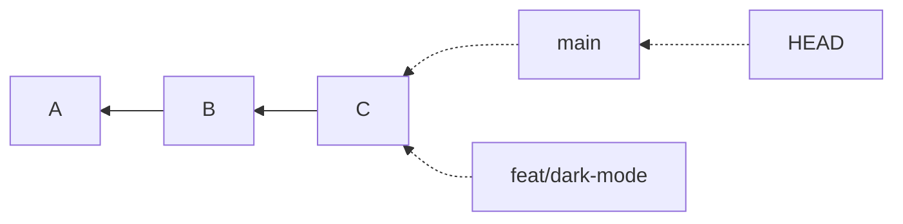
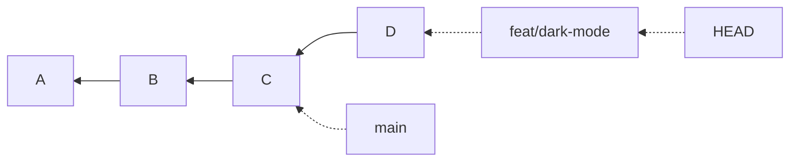

# CH-05 — Branches & Merging

Canonical home of: **branch mechanics**, **`git merge` and merge strategies (fast-forward vs
three-way)**. Conflicts get their own chapter (CH-10); everything else about
merging is here.

---

## Before you start

You must be able to state CH-02's pointer model: *a branch is a file containing one commit ID;
HEAD says which pointer you are moving.* If that sentence is not yet obvious, re-read
CH-02 §F
before continuing. Branching is trivial with the model and baffling without it.

---

## A. Ask yourself

1. You have a working website. You want to try a risky redesign that will take a week and might
   fail. Without Git, what do you do? What are the costs?
2. Three people work on three features simultaneously. All are half-finished on Friday. Your demo
   is Saturday. How do you ship *only* the finished one?
3. If a branch is "a pointer to a commit," what physically happens when you create one? How long
   should that take on a 3 GB repository?
4. You merge `feature` into `main`. What happens to the `feature` branch?
5. Two branches changed *different* files. Should merging them ever conflict?

<details>
<summary><strong>Answers</strong></summary>

1. Copy the folder to `site_redesign/`. Costs: you now maintain two folders; bug fixes must be
   applied twice; you cannot easily compare; you cannot combine them at the end except by hand;
   and after a week you cannot remember which is current. Branches solve all four.
2. You cannot, unless the work was isolated. If everyone committed to one line, the finished
   feature is entangled with two unfinished ones. **Branches make "ship only this" possible** —
   that is the core argument for them, and it is a business argument, not a technical one.
3. Git writes a 41-byte file under `.git/refs/heads/`. It takes the same time on a 3 GB repository
   as on an empty one — microseconds. Cheap branching is *why* Git-based workflows look the way
   they do.
4. Nothing. It still exists and still points where it did. Merging copies nothing and moves only
   the branch you merged *into*. You may then delete `feature` — deleting it loses nothing,
   because its commits are now reachable from `main`.
5. Usually no — Git merges per-file and, within a file, per-region. Different files merge cleanly.
   But "usually": edits to the *same region* conflict, and a file deleted on one side and modified
   on the other conflicts even though only one side "changed" it (CH-10).

</details>

---

## B. Analogy, then the real thing

**Analogy.** A branch is a **parallel universe of your project**. You step into it, change things
freely, and the original universe is untouched. When your changes are good, you merge the
universes back together.

**Where it breaks:** universes are expensive; branches are 41 bytes. Nothing is copied, nothing is
duplicated. The commits are all in one shared object database — a branch is just a *name for a
place in the graph*.

Better mental image for the technical model: the commit graph is a river delta. Commits are the
water. Branch names are signposts stuck in the ground at particular points, and they get moved
downstream as you work.

---

## C. What a branch actually is `MUST KNOW`

```bash
git branch feat/dark-mode
cat .git/refs/heads/feat/dark-mode
# 7c1e4a9f...   <- the same commit id main points at
```

One file. One line. That's the branch.



Both names point at `C`. There is one copy of the project.

Now commit while on `feat/dark-mode`:



**The branch you are on moves. Others do not.** That is the entire rule.

---

## D. Working with branches `MOST USED`

### Create and switch

```bash
git branch feat/dark-mode          # create, stay where you are
git switch feat/dark-mode          # move HEAD there
git switch -c feat/dark-mode       # create AND switch  <- what you'll use 95% of the time
git switch -                       # back to the previous branch (like `cd -`)
```

`git switch` and `git restore` (Git 2.23+) split the old, overloaded `git checkout` into two
clearer commands:

| Old                          | New                              | Does                                 |
| ---------------------------- | -------------------------------- | ------------------------------------ |
| `git checkout <branch>`    | `git switch <branch>`          | Move to a branch                     |
| `git checkout -b <branch>` | `git switch -c <branch>`       | Create and move                      |
| `git checkout -- <file>`   | `git restore <file>`           | ⚠ Discard working-directory changes |
| `git checkout <commit>`    | `git switch --detach <commit>` | Detached HEAD (CH-14)                |

`checkout` still works and you will see it everywhere online. Prefer `switch`/`restore` for your
own work — the ambiguity of `checkout` is a genuine source of destroyed work, because
`git checkout <name>` silently discards a file if `<name>` happens to be a filename.

### Inspect

```bash
git branch                    # local branches; * marks current
git branch -v                 # + last commit on each
git branch -a                 # + remote-tracking branches (CH-06)
git branch --merged main      # branches fully contained in main -> safe to delete
git branch --no-merged main   # branches with unique work -> deleting loses reachability
git log --oneline --graph --all --decorate    # the real picture
```

### Rename and delete

```bash
git branch -m old-name new-name      # rename (-m on the current branch: git branch -m new-name)
git branch -d feat/dark-mode         # delete — refuses if unmerged (safe)
git branch -D feat/dark-mode         # ⚠ force delete even if unmerged
```

`-d` refusing is a feature. If it refuses, Git is telling you that commits would become
unreachable by any name. They are still recoverable via `reflog` (CH-12), but heed the warning.

### Naming convention (used throughout this course)

```text
type/short-description

feat/mess-feedback-form
fix/login-redirect-loop
docs/setup-instructions
refactor/complaint-store
exp/try-sqlite
```

Rules: lowercase, hyphens, no spaces, describe *the change* not yourself (`asha-branch` tells
nobody anything). Some teams prefix with an issue number: `feat/42-dark-mode`. Slashes are just
characters in the name — Git happens to display them as folders in some tools.

### Switching with uncommitted work

```bash
git switch other-branch
# error: Your local changes to 'app.py' would be overwritten by checkout.
```

Git is protecting the one fragile tree. Three legitimate options:

1. **Commit** — best if the work is coherent.
2. **Stash** — `git stash` (CH-12), best for a genuine interruption.
3. **Discard** — ⚠ `git restore app.py`, if the work is worthless.

If your changes don't touch files that differ between the branches, Git carries them across
silently. That's convenient and occasionally surprising.

---

## E. Merging `MOST IMPORTANT`

Merging combines another branch's work **into the branch you are on**. Direction matters, and
beginners get it backwards constantly:

```bash
git switch main                  # 1. GO TO the destination
git merge feat/dark-mode         # 2. BRING IN the source
```

*Read it as: "into main, merge dark-mode."*

### Case 1 — Fast-forward

`main` has not moved since you branched. There is nothing to combine — Git just slides the pointer
forward.

```text
before:            A ── B ── C ── D          after:   A ── B ── C ── D
                        ▲         ▲                             ▲    ▲
                       main   feature                          ...  main, feature
```

```bash
git merge feat/dark-mode
# Updating 7c1e4a9..b2d81f0
# Fast-forward
#  src/theme.css | 24 ++++++++++++
```

No merge commit is created. The history stays linear — and the fact that a branch ever existed
disappears from the graph.

Force a merge commit to preserve that information:

```bash
git merge --no-ff feat/dark-mode
```

Many teams require `--no-ff` for feature branches so the history shows *"these five commits were
one feature."* GitHub's "Create a merge commit" button does exactly this (CH-09).

### Case 2 — Three-way merge

Both branches have new commits. Git must genuinely combine them.

```text
        C ── D          (feat/dark-mode)
       /
A ── B ── E ── F        (main)
```

Git finds the **merge base** — the last commit both branches share (`B`) — and compares each side
against it. Changes only one side made are taken; changes both made in the same region become a
conflict (CH-10).

Result: a **merge commit** with two parents.

```text
        C ── D
       /       \
A ── B ── E ── F ── M     (main)   M has parents F and D
```

```bash
git merge feat/dark-mode
# Merge made by the 'ort' strategy.
```

Git opens an editor for the merge commit message; the default (`Merge branch 'feat/dark-mode'`) is
usually fine. Add a line about *why* if the merge is significant.

> The merge commit's **first parent** is the branch you were on. This is why `git log --first-parent`
> on `main` shows one entry per merged feature — a genuinely useful view of a busy repository.

### Case 3 — Conflict

Both sides changed the same region. Git stops and asks you to decide. That is
[CH-10](../10-conflicts/) — a whole chapter, because doing it *correctly* is a real skill.

### After the merge

```bash
git branch -d feat/dark-mode     # safe: commits are now reachable from main
```

Deleting a merged branch loses nothing. Long-lived stale branches are a real cost — nobody knows
which are alive.

### Undoing a merge

| Situation                      | Command                                                                 |
| ------------------------------ | ----------------------------------------------------------------------- |
| Merge conflicted, you want out | `git merge --abort`                                                   |
| Merge completed, not pushed    | ⚠`git reset --hard HEAD~1` (CH-12)                                   |
| Merge completed and pushed     | `git revert -m 1 <merge-sha>` (CH-12) — never rewrite shared history |

---

## F. Worked example — three parallel features

The club website. Three people, one repository, one afternoon.

```bash
git switch main
git switch -c feat/events-page
# ... work ...
git commit -am "feat(events): add upcoming events listing"

git switch main
git switch -c feat/contact-form
git commit -am "feat(contact): add contact form"

git switch main
git commit -am "fix(nav): correct broken about link"     # a hotfix straight on main

git log --oneline --graph --all --decorate
# * 9a1b2c3 (HEAD -> main) fix(nav): correct broken about link
# | * 4d5e6f7 (feat/contact-form) feat(contact): add contact form
# |/
# | * 1a2b3c4 (feat/events-page) feat(events): add upcoming events listing
# |/
# * 7c1e4a9 docs: add project README
```

Three independent lines from one base. Now the events page is finished and reviewed:

```bash
git switch main
git merge --no-ff feat/events-page
git branch -d feat/events-page
```

`feat/contact-form` is untouched and still unfinished — and `main` is shippable. **That is the
whole point of branching**, expressed in one command sequence.

---

## G. Brainstorm — predict first

Write your answer, then verify in a scratch repository.

1. `main` and `feature` both point at commit `C`. You switch to `feature` and commit `D`. Where
   does `main` point?
2. You are on `main`. You run `git merge feature` where `feature` is 3 commits ahead and `main`
   has no new commits. How many commits does `main` gain? Is there a merge commit?
3. Same, but `main` also has 2 new commits. Now how many commits does `main` gain?
4. You create `feat/x`, commit twice, then run `git branch -d feat/x` from `main`. What happens?
5. You are on `feat/x` with uncommitted changes to `README.md`. `README.md` is identical on
   `main`. You run `git switch main`. What happens to your changes?
6. You merge `feature` into `main`, then merge `main` into `feature`. What does the graph look
   like? Is the second merge useful?

<details>
<summary><strong>Answers</strong></summary>

1. Still at `C`. Only the branch HEAD points to moves.
2. Gains 3 commits. **No merge commit** — it fast-forwards, because `main`'s commit is an ancestor
   of `feature`'s. Use `--no-ff` if you want the feature boundary recorded.
3. Gains 4: the 3 from `feature` plus **one merge commit** with two parents. The histories had
   diverged, so a fast-forward is impossible.
4. Git **refuses**: "the branch is not fully merged." Its two commits are reachable from no other
   branch. `-D` would force it; the commits survive in `reflog` for a while (CH-12).
5. They come with you. Git only refuses when carrying changes would require overwriting a file
   that differs between the two commits. Here it doesn't, so the edit rides along — a common
   surprise, and a reason people accidentally commit to the wrong branch.
6. `main` gets merge commit `M1`; `feature` gets merge commit `M2` whose parents are `feature`'s
   tip and `M1`. The second merge is genuinely useful **while `feature` is still being worked on**
   (it brings `feature` up to date with `main`, catching integration problems early). If `feature`
   is finished, it just adds noise — delete the branch instead.

</details>

---

## H.Common mistakes

| Symptom                                  | Cause                                                                  | Fix                                                                                                       | Prevention                                              |
| ---------------------------------------- | ---------------------------------------------------------------------- | --------------------------------------------------------------------------------------------------------- | ------------------------------------------------------- |
| Committed to the wrong branch            | Forgot to switch                                                       | Not pushed:`git switch right-branch`, `git cherry-pick <sha>`, then reset the wrong branch (CH-12/14) | Put the branch name in your shell prompt                |
| Merged in the wrong direction            | Ran`git merge main` while on `feature` when they meant the reverse | `git reset --hard ORIG_HEAD` if unpushed                                                                | Say it aloud: "into X, merge Y"                         |
| "My changes disappeared after switching" | They were on the other branch all along                                | `git log --all --oneline` — they're safe                                                               | Read`git status` before switching                     |
| `-d` refuses to delete                 | Branch has unmerged commits                                            | Merge it, or`-D` if genuinely disposable                                                                | Check`git branch --no-merged` first                   |
| Dozens of stale branches                 | Never deleted after merging                                            | `git branch --merged main` then delete                                                                  | Delete on merge; GitHub can do it automatically (CH-09) |
| Branched from the wrong base             | Forgot to`switch main` first                                         | `git rebase --onto main wrong-base feat/x` (CH-13)                                                      | `git switch main && git pull` before every new branch |
| Merge commit with a useless message      | Accepted the default without thought                                   | Fine for routine merges                                                                                   | Add*why* when the merge is significant                |
| Long-lived branch that will not merge    | Diverged for weeks                                                     | Merge`main` into it regularly                                                                           | Integrate early; small branches merge cleanly           |

---

## I. Check your understanding

1. What are the *only* things that change when you run `git branch new-thing`?
2. Explain fast-forward vs three-way merge, and what determines which one happens.
3. You are on `main` and run `git merge feature`. Which branch pointer moves?
4. Why does deleting a merged branch lose nothing?
5. What is a merge base, and why does Git need it?
6. When would you deliberately use `--no-ff`?

<details>
<summary><strong>Answers</strong></summary>

1. One new file appears under `.git/refs/heads/` containing the current commit ID. Nothing else —
   not HEAD, not your files.
2. Fast-forward happens when the current branch's commit is an **ancestor** of the branch being
   merged — no combining is required, so the pointer just moves. Three-way happens when both have
   diverged; Git compares both against the merge base and creates a commit with two parents.
3. Only `main` (the branch you are on). `feature` is untouched.
4. The commits are reachable from `main` after the merge; you deleted a name, not the objects.
5. The most recent common ancestor of the two branches. Git needs it to tell *what each side
   changed* — without a baseline it could only see two different files and would have to ask about
   everything.
6. When you want the history to record that a group of commits formed one feature — for
   readability, and so the whole feature can be reverted with a single `revert -m 1`.

</details>
